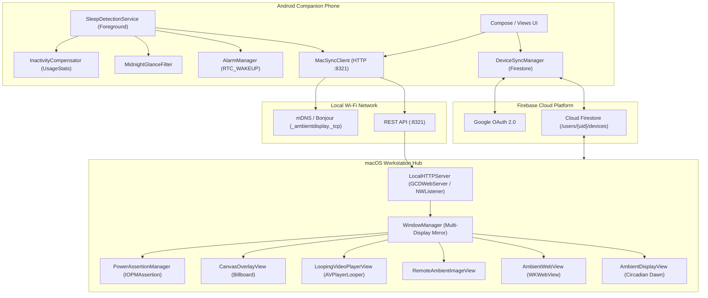
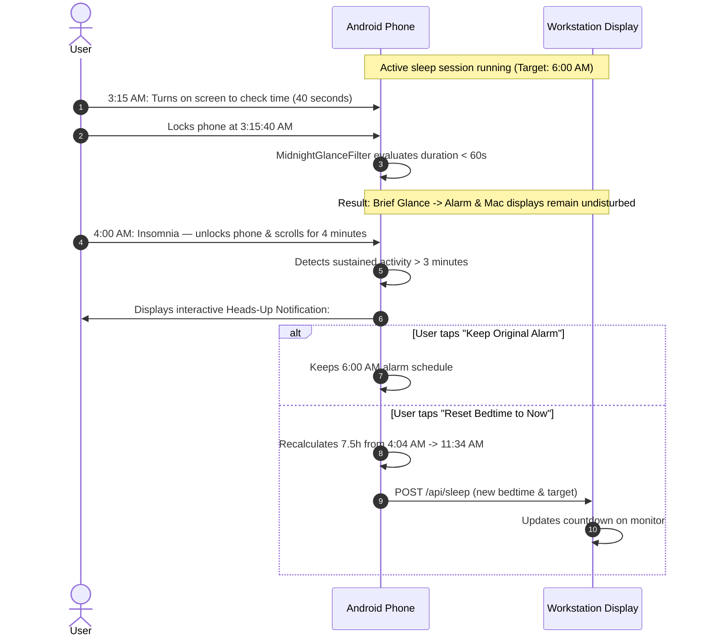
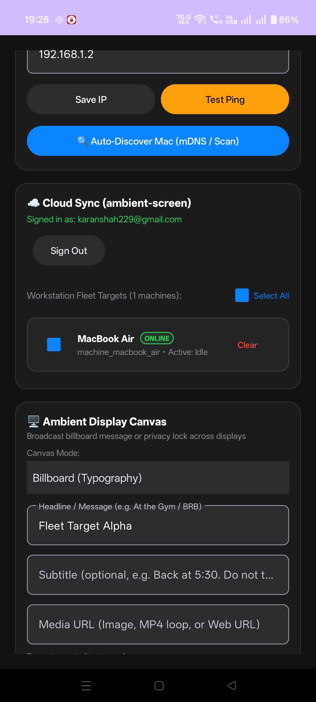
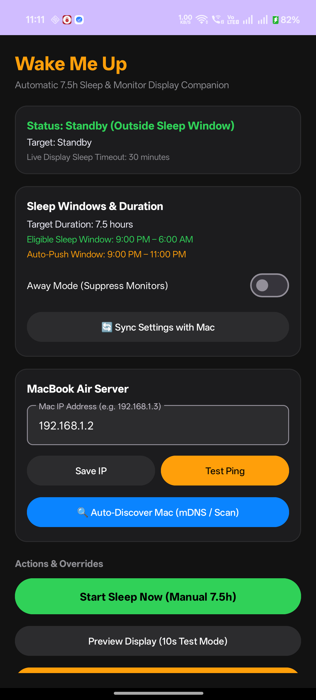
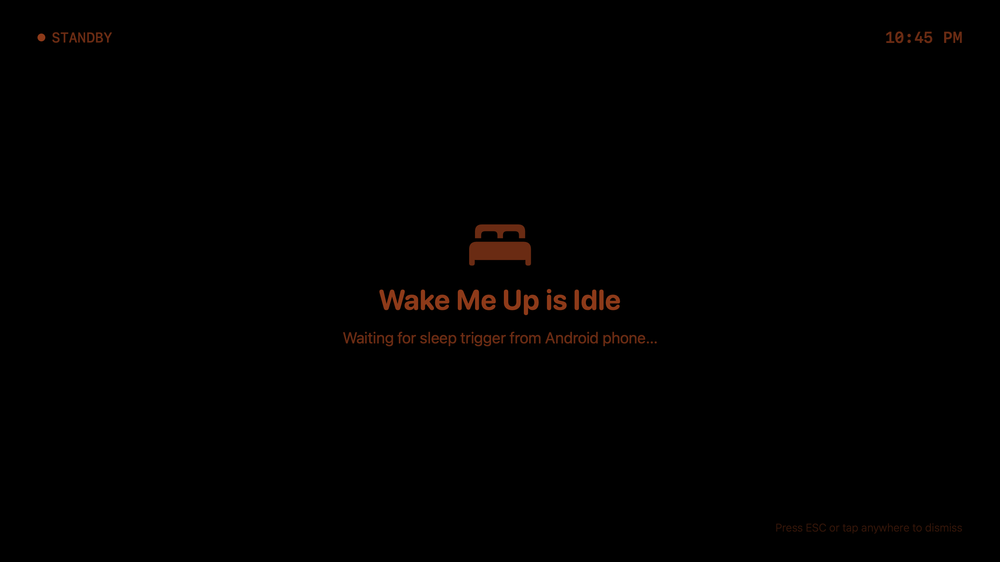
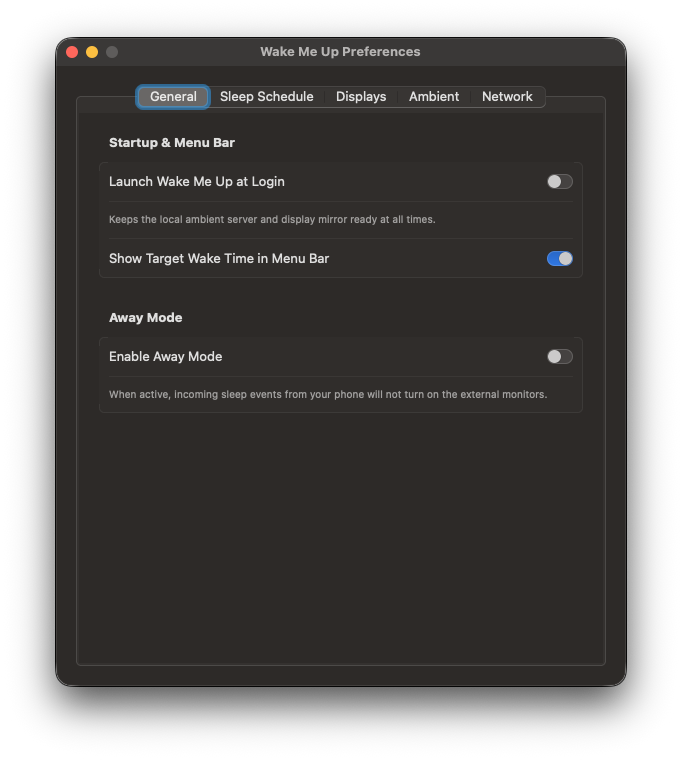
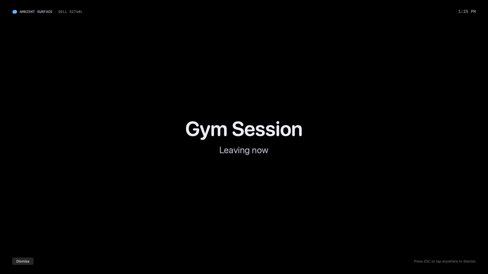
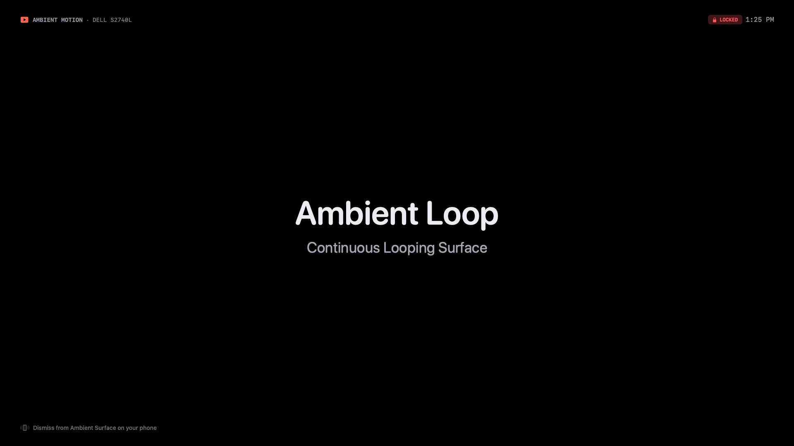
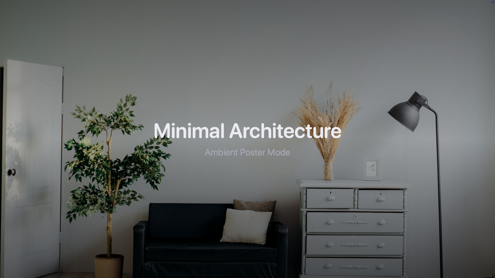

# Ambient Display: Mobile App Design Handbook & Product Blueprint 📱✨

> **Audience:** Senior Product Designers, UI/UX Specialists, and Mobile Engineers  
> **Target Platform:** Android (Jetpack Compose / Modern Material 3 / Custom Calm Design System) paired with macOS Workstations  
> **Objective:** Deliver the complete domain knowledge, technical foundations, user journeys, edge cases, and design specifications required to transform the current functional Android companion into a calm, world-class modern mobile experience.

---

## 1. Executive Product Brief

### 1.1 The Problem
Conventional alarm clocks require constant cognitive friction:
1. **Manual Planning & Fatigue:** You must calculate your bedtime, choose a wake time, and set it every night. If you aim for 7.5 hours of sleep but spend an extra 45 minutes reading, watching videos, or winding down in bed, traditional alarms do not adapt—they sound prematurely, interrupting REM cycles and leaving you feeling groggy.
2. **Abrupt Sensory Shock:** Standard alarms blare unexpectedly in pitch-dark rooms, releasing cortisol and adrenaline instead of easing your nervous system awake.
3. **Wasted Workstation Screens:** Modern bedrooms and home offices feature large external displays (MacBook screens, Studio Displays, 4K monitors, TV setups) that sit idle, completely dark, or emit harsh blue-light screensavers.
4. **Lack of Ambient Workspace Communication:** When stepping away from a desk (e.g., gym, lunch, walking the dog, or deep focus), leaving notes or status reminders on workstation screens requires clunky manual screen locks or sticky notes.

### 1.2 The Solution
**Ambient Display** is a dual-device ambient intelligence system that links your **Android phone** to your **macOS workstation fleet**:
* **Zero-Friction Sleep Tracking:** You never have to "set" an alarm. The app silently tracks when you truly put your phone down to sleep during your nocturnal window, deducts pre-lock phone inactivity using Android usage history, and automatically schedules an exact 7.5-hour circadian target.
* **Circadian Dawn Simulation Across Workstation Displays:** Connected Mac displays stay completely dark during deep sleep (except for an ultra-dim, OLED-safe time indicator), transition into a warm sunrise glow (amber to soft coral) 30 minutes before wake-up, and greet you with morning solar radiance when your phone sounds.
* **Midnight Glance Intelligence:** Checking the time or flashlight for 45 seconds at 3:00 AM does not disturb your alarm. However, if you experience insomnia and stay on your phone for over 3 minutes, the app gently presents an interactive notification asking whether to keep your schedule or reset your bedtime forward.
* **Workstation Canvas Billboard & Media Studio:** Beyond sleep, your phone acts as a remote commander for your desk displays. You can broadcast high-impact typography billboards ("At the Gym", "Back in 15m"), loop ambient relaxing videos, display motivational posters, or show live web dashboards—either over local Wi-Fi or across the world via Google-authenticated Cloud Sync.

---

## 2. Feature-by-Feature Deep Dive

Ambient Display consists of four interconnected product pillars: **Sleep & Circadian Alarm**, **Remote Ambient Canvas**, **Workstation Fleet Targeting**, and **Circadian Settings & System Immunity**.

```
┌────────────────────────────────────────────────────────────────────────────────────────┐
│                                AMBIENT DISPLAY ECOSYSTEM                               │
├────────────────────────────────┬───────────────────────────────┬───────────────────────┤
│    1. CIRCADIAN SLEEP & ALARM  │    2. AMBIENT CANVAS STUDIO   │ 3. WORKSTATION FLEET  │
├────────────────────────────────┼───────────────────────────────┼───────────────────────┤
│ • Silent Sleep Detection       │ • Typography Billboard        │ • Cloud Fleet Manager │
│ • Pre-Lock Inactivity Gap      │ • Ambient Looping Video       │ • Real-time Heartbeat │
│ • Auto-Push Window (9-11 PM)   │ • Ambient Image Poster        │ • Selective Targeting │
│ • Midnight Glance Filter       │ • Live Web Dashboard          │ • Broadcast Dispatch  │
│ • Circadian Sunrise (T - 30m)  │ • Duration (15s/30s/Infinite) │ • Per-Machine Clear   │
│ • Hardware RTC Failsafe Alarm  │ • Dismiss Policy (Phone/ESC)  │ • Dual-Tier Sync      │
└────────────────────────────────┴───────────────────────────────┴───────────────────────┘
```

### 2.1 Pillar 1: Intelligent Sleep Detection & Circadian Alarm
1. **Screen Lock Trigger:** When the user locks their device during the eligible window (default: `9:00 PM – 6:00 AM`), the Android service initiates an active sleep session. Daytime phone locks (e.g. 2:00 PM at work) are ignored.
2. **Pre-Lock Inactivity Compensation:** If a user falls asleep while watching a movie or reading, leaving their phone untouched for 35 minutes before the screen times out, the app checks `UsageStatsManager` for the exact last user interaction. It backdates the bedtime timestamp by the inactivity duration, ensuring the user gets their true intended rest.
3. **Dynamic Auto-Push Window (Default: 9:00 PM – 11:00 PM):** If the user locks their phone at 9:30 PM (target 5:00 AM), but unlocks at 10:15 PM to reply to a text and locks it again at 10:30 PM, the system automatically pushes the target wake-up time to 6:00 AM without nagging notifications.
4. **Midnight Glance Filter (< 60s):** Waking up in the middle of the night to check the clock, sip water, or use the flashlight does not restart or cancel the ongoing sleep session.
5. **Prolonged Nighttime Activity Prompt (> 3 mins):** If the user stays awake on their phone past 3 minutes between 11:00 PM and 6:00 AM, a high-priority heads-up prompt offers two clear choices:
   - *Keep Original Alarm:* Retain the scheduled morning alarm.
   - *Reset Bedtime to Now:* Recalculate 7.5 hours from the current moment.
6. **Hardware RTC Alarm:** Bypasses Android Doze mode and volume silencers via `AlarmManager.RTC_WAKEUP` and audio attributes (`USAGE_ALARM`), triggering ringtone playback and continuous vibration.
7. **Away Mode:** Temporarily pauses workstation display wake-up while preserving phone alarms—ideal for travel or sleeping away from the workstation desk.

### 2.2 Pillar 2: Remote Ambient Canvas Studio
1. **Typography Billboard:** High-visibility across-the-room messaging with dynamic font scaling (80pt for short punchy phrases like "At the Gym", scaling down for longer sentences). Optional subtitle and timestamp.
2. **Ambient Looping Video:** Streams seamless, hardware-accelerated video loops (e.g., lofi fireplace, rain on glass, cybernetic anime loops) rendered natively on Mac displays via `AVPlayerLooper`.
3. **Ambient Image Poster:** Full-screen photography or artwork with subtle gradient vignettes for readable headline overlays.
4. **Live Web Dashboard:** Embeds web monitoring boards, Grafana panels, or web apps via native `WKWebView`.
5. **Dismissal Policies:**
   - `esc_any`: Anyone sitting at the desk can press `ESC` or click the mouse on the Mac to dismiss the screen.
   - `phone_only`: Locks the canvas on the workstation display; only dismissible via the companion phone or remote cloud clear.
6. **Duration Modes:**
   - *Persistent Canvas:* Remains active until explicitly dismissed.
   - *Timed Toast (15s or 30s):* Shows an animated countdown badge and automatically returns to the prior screen state.

### 2.3 Pillar 3: Multi-Machine Workstation Fleet Targeting
1. **Cloud Fleet Discovery:** Authenticates via Google Sign-In and discovers all registered desktop machines linked to the user's account.
2. **Real-Time Presence Heartbeat:** Evaluates machine health every 90 seconds. Machines display clear `ONLINE` or `OFFLINE` status pills.
3. **Selective or Broadcast Dispatch:** Target a specific machine (e.g., `MacBook Air`, `Studio Display Desk`, `Office Mac mini`) or broadcast across the entire fleet simultaneously.
4. **Per-Machine Quick Clear:** Dismiss active canvases individually per machine or fleet-wide with a single tap.

### 2.4 Pillar 4: Circadian Settings & System Immunity
1. **Configurable Sleep Schedule:** Fine-tune target sleep hours (1.0h to 16.0h), eligible sleep window hours, auto-push window hours, and inactivity thresholds.
2. **Custom Ambient Color Shaders:** Customize the exact RGB hex colors for Deep Night (`#D95926`), Dawn (`#FA7268`), and Wake-Up Ready (`#FFD000`).
3. **OEM Background Immunity Checklist:** Direct-action shortcuts for aggressive OEM battery management (OnePlus/Oppo OxygenOS, Xiaomi MIUI, Samsung OneUI):
   - Battery Optimization Unrestricted
   - Usage Access Permission
   - Accessibility Watchdog Service
   - Auto-Launch Authorization

---

## 3. Technical Architecture & Communication Protocols

Ambient Display uses a **Local-First, Cloud-Augmented** architecture.



### 3.1 Dual-Tier Connectivity Flow
* **Tier 1: Local Wi-Fi (Sub-50ms Latency):**
  - Mac broadcasts `_ambientdisplay._tcp` on local Wi-Fi.
  - Android auto-discovers the Mac IP via Bonjour or concurrent subnet sweep (`/24` in <200ms).
  - Commands use lightweight HTTP REST payloads on port `8321`.
* **Tier 2: Cloud Firestore (Global Remote Dispatch):**
  - Authenticated via Google OAuth 2.0.
  - Security rules restrict read/write access to `/users/{uid}/*`.
  - Machines listen to real-time snapshot listeners for immediate dispatch across cellular and disjoint Wi-Fi networks.

### 3.2 Key REST API Contracts
| Endpoint | Method | Payload Summary | Purpose |
| :--- | :--- | :--- | :--- |
| `/api/status` | `GET` | Response: `state`, `away_mode`, `active_monitors` | Polls current Mac state |
| `/api/sleep` | `POST` | `{"bedtime_epoch_ms": 1727980000000, "duration_minutes": 450}` | Starts sleep session & displays ambient countdown |
| `/api/wake` | `POST` | `{}` | Dismisses ambient screens, releases power locks |
| `/api/canvas` | `POST` | `{"type": "billboard", "title": "Gym", "policy": "phone_only"}` | Renders custom canvas on targeted displays |
| `/api/canvas/dismiss` | `POST` | `{"target_display_id": "all"}` | Dismisses canvas & restores desktop or sleep state |
| `/api/displays` | `GET` | Response: list of displays with hardware IDs & modes | Lists all connected monitors |
| `/api/config` | `POST` | `{"default_sleep_hours": 7.5, "night_hex": "#D95926"}` | Two-way preference synchronization |

---

## 4. End-to-End User Journeys & Edge Cases

### 4.1 Journey 1: The Zero-Touch Night
```mermaid
sequenceDiagram
    autonumber
    actor User as User
    participant Phone as Android Phone
    participant Mac as MacBook / External Monitors

    User->>Phone: Reads in bed, sets phone down at 10:15 PM
    Note over Phone: Phone screen times out at 10:17 PM
    Phone->>Phone: InactivityCompensator detects 25m passive viewing
    Phone->>Phone: Computes true bedtime = 9:52 PM, target = 5:22 AM
    Phone->>Phone: Schedules exact RTC alarm for 5:22 AM
    Phone->>Mac: POST /api/sleep (bedtime, duration)
    Mac->>Mac: PowerAssertionManager holds display awake
    Mac->>Mac: Displays pure black canvas with dim countdown (#D95926)

    Note over User, Mac: 4:52 AM (T - 30 minutes: Dawn Phase Begins)
    Mac->>Mac: Fades smoothly into Sunrise Coral (#FA7268)

    Note over User, Mac: 5:22 AM (Target Alarm Time)
    Phone->>User: Plays alarm audio & vibrates; shows full-screen dismiss UI
    Mac->>Mac: Displays Radiant Solar Gold (#FFD000) "Good Morning" greeting
    User->>Phone: Slides to dismiss alarm
    Phone->>Mac: POST /api/wake
    Mac->>Mac: Releases power assertions, restores standard desktop
```

### 4.2 Journey 2: Midnight Glance vs. Insomnia


### 4.3 Comprehensive Edge Case Matrix
| Edge Case | System Behavior | Designer Consideration |
| :--- | :--- | :--- |
| **Phone reboot during sleep** | `BootCompletedReceiver` restores RTC alarm and restarts foreground service. | The UI should reflect "Session Restored" gracefully without confusing errors. |
| **Mac Wi-Fi IP changes (DHCP lease)** | mDNS discovery and subnet probe resolve the new IP in <200ms. | Show smooth connection state pills instead of noisy IP disconnect modals. |
| **MacBook lid closed (Clamshell)** | Power assertions prevent sleep if connected to power adapter. | Remind user during onboarding to keep Mac connected to power if using clamshell. |
| **Mac locked (`Cmd+Ctrl+Q`)** | macOS `loginwindow` blocks app overlays from rendering. | Display an in-app tip: *"Leave Mac logged in or configure display sleep settings for full screen experience."* |
| **Phone Wi-Fi disconnected** | Phone alarm rings via local hardware RTC. | Provide a subtle offline banner while reassuring user that the morning alarm is 100% safe. |
| **Daytime phone lock (2:00 PM)** | Filtered out by eligible sleep window (`9 PM – 6 AM`). | Standby status should indicate *"Monitoring standby • Sleep window starts at 9:00 PM"*. |

---

## 5. Visual Gallery: Fresh Device Screenshots & Interface Audit

### 5.1 Mobile Companion App (Current Implementation)

| 1. Live Home Top | 2. Live Home Bottom | 3. Active Sleep Mode |
| :---: | :---: | :---: |
|  |  |  |
| *Status card, duration chips, away mode* | *OnePlus immunity checklist, debug triggers* | *Real-time bedtime & calculated target* |

| 4. Standby Notification | 5. Sleeping Notification | 6. Midnight Activity Prompt |
| :---: | :---: | :---: |
|  |  |  |
| *Android shade standby indicator* | *Target wake-up time in shade* | *Interactive Keep vs Reset actions* |

| 7. Canvas Billboard Composer | 8. Google Cloud & Fleet Manager | 9. Hardware Alarm Ringing |
| :---: | :---: | :---: |
|  |  |  |
| *Message input, quick chips, display selector* | *Online pills, fleet targets, quick clear* | *Heads-up alarm ringing with dismiss button* |

### 5.2 macOS Menu Bar App & Workstation Displays

| 1. Mac Menu Bar & Idle Desktop | 2. Preferences: General | 3. Preferences: Sleep Schedule |
| :---: | :---: | :---: |
|  |  |  |
| *Native NSStatusItem in macOS menu bar* | *Launch at login, Away mode* | *Window hours, inactivity offset* |

| 4. Preferences: Displays Manager | 5. Preferences: Ambient Color Shaders | 6. Preferences: Network & Pairing |
| :---: | :---: | :---: |
|  |  |  |
| *Connected screens & ignore toggles* | *Color preview & test buttons* | *Port 8321, mDNS, local IP* |

### 5.3 Workstation Ambient Canvas Renderers

| 1. Deep Night (#D95926) | 2. Dawn Transition (#FA7268) | 3. Wake-Up Ready (#FFD000) |
| :---: | :---: | :---: |
|  |  |  |
| *Midnight Ember countdown* | *Sunrise Coral circadian fade* | *Radiant Solar Gold greeting* |

| 4. Screen Billboard ("Gym") | 5. Looping Ambient Video | 6. Ambient Image Poster |
| :---: | :---: | :---: |
|  |  |  |
| *High-visibility typography* | *Hardware-accelerated AVPlayer loop* | *High-res photo with text overlay* |

---

## 6. Mobile Redesign Blueprint: The Designer's Specification

### 6.1 Current UI Audit & Pain Points
While functionally complete, the current mobile interface suffers from several developer-centric design patterns:
1. **Visual Clutter:** Developer debug buttons (`Test 10s Preview`, `Trigger 1-Min Test Sleep`, `Alarm 5s Test`) sit right beside daily consumer controls.
2. **Technical Density:** Raw IP addresses (`192.168.1.189`), hex codes (`#D95926`), and raw number fields dominate the screens.
3. **Flat Card Stacking:** The screens resemble a long vertical scrolling list of Android cards without visual breathing room or clear hierarchy.
4. **Lack of Calmness:** Sleep and wellness apps require an atmospheric, tranquil feel (deep obsidian blacks, soft ambient glows, organic dials, smooth transitions) rather than clinical settings panels.

---

### 6.2 Recommended Design System Tokens

#### Color Palette
```
┌──────────────────┬───────────┬─────────────────────────────────────────────────────────┐
│ Token            │ Hex       │ Role                                                    │
├──────────────────┼───────────┼─────────────────────────────────────────────────────────┤
│ Background Pure  │ #000000   │ True OLED blackout for bedroom sleep viewing            │
│ Surface Deep     │ #0E0E11   │ Primary container surface (cards, bottom sheets)        │
│ Surface Raised   │ #18181D   │ Interactive cards, selected chips, popovers             │
│ Surface Stroke   │ #26262E   │ 1px subtle border outlines (glassmorphic structure)     │
│ Accent Ember     │ #FF8C38   │ Deep night circadian phase, primary active tint         │
│ Accent Dawn      │ #FA7268   │ Sunrise coral, dawn transition countdown                │
│ Accent Solar     │ #FFD000   │ Morning wake-up gold, celebratory energy                │
│ Status Online    │ #30D158   │ Fleet machine active, healthy connection pill           │
│ Status Offline   │ #8E8E93   │ Inactive / disconnected machine state                   │
│ Text Primary     │ #FFFFFF   │ High-contrast headers, time displays                    │
│ Text Secondary   │ #A1A1AA   │ Subtitles, metrics, explanatory labels                  │
│ Text Muted       │ #52525B   │ Inactive states, metadata timestamps                    │
└──────────────────┴───────────┴─────────────────────────────────────────────────────────┘
```

#### Typography
* **Display / Clock Numbers:** SF Pro Rounded / Inter Display (Semi-Bold, tabular numbers for countdowns).
* **Headings:** Inter / SF Pro Display (Bold, 20pt–24pt).
* **Body / Controls:** Inter / SF Pro Text (Medium, 14pt–16pt).
* **Metadata / Monospace:** JetBrains Mono / SF Mono (12pt, uppercase tracking for status pills).

---

### 6.3 Modern 4-Tab Information Architecture

```
┌──────────────────────────────────────────────────────────────────────────────┐
│                         AMBIENT DISPLAY MOBILE APP                           │
└──────────────────────────────────────────────────────────────────────────────┘
  ┌───────────────┬────────────────┬───────────────────┬─────────────────────┐
  │ 🌙 REST       │ 🎨 CANVAS      │ 🖥️ FLEET          │ ⚙️ SETTINGS         │
  │ • Circadian   │ • Billboard    │ • Workstation Hub │ • Sleep Windows     │
  │   Arc Dial    │   Composer     │ • Online Status   │ • Inactivity Offset │
  │ • Target Wake │ • Video Loops  │ • Quick Clear     │ • Ambient Colors    │
  │ • Quick Chips │ • Presets      │ • Multi-Machine   │ • Device Health     │
  │ • Hardware    │ • Display Map  │   Dispatch        │   & OEM Immunity    │
  │   Pill        │ • Dismiss Mode │ • Cloud Sign-In   │ • Developer Tools   │
  └───────────────┴────────────────┴───────────────────┴─────────────────────┘
```

---

### 6.4 Detailed Screen-by-Screen Specifications

#### Screen 1: Rest & Circadian Dashboard (`Tab 1`)
* **Hero Circadian Visualizer:**
  - A circular 24-hour arc dial showing the **Current Time**, **Bedtime Anchor**, and **Target Wake-Up Time**.
  - Color gradient on the arc illustrates the 3 sleep phases: Deep Night (`#FF8C38`), Dawn (`#FA7268`), and Wake (`#FFD000`).
* **Connection Island:**
  - A compact top pill showing Mac connection status:  
    `🟢 Karan's MacBook Air (Dell 27") • Local Wi-Fi`  
    *(Tapping opens a quick preview sheet or triggers a 10s monitor test).*
* **Target Duration Selector:**
  - Segmented pill bar: `6.0h` | `7.0h` | `7.5h (Optimal)` | `8.0h` | `9.0h`.
* **Sleep Action Button:**
  - Elegant pill button with subtle glowing border:  
    `🌙 Start Sleep Session (7.5h)`  
    *(When active, transforms into a pulsing timer with a gentle "End Sleep Session" secondary control).*
* **Away Mode Switch:**
  - Calm switch with clear helper text: *"Away Mode: Pauses workstation screens when sleeping away from home."*

#### Screen 2: Ambient Canvas Studio (`Tab 2`)
* **Visual Type Carousel:**
  - 4 visual card selectors with icons and preview thumbnails:
    1. **Billboard** (Custom typography text)
    2. **Ambient Video** (Looped relaxing video streams)
    3. **Image Poster** (Scenic artwork & photos)
    4. **Web Dashboard** (Live URL / monitoring)
* **Message & Media Composer:**
  - Expanding text field with character count.
  - Quick-preset chips: `At the Gym`, `Back in 15m`, `Focus Time`, `Do Not Touch`.
  - Media URL input with live thumbnail preview.
* **Target Display Segmented Switch:**
  - Automatically queries connected displays: `All Displays (Mirrored)` | `Dell 27" 4K` | `Built-in Retina`.
* **Behavior & Lock Policy:**
  - Segmented control: `Dismiss via ESC` | `🔒 Locked (Phone Only)`.
  - Duration picker: `Infinite (Stay)` | `15 Seconds` | `30 Seconds`.
* **Action Footer:**
  - Primary button: `Broadcast to Screen` (with glowing gradient).
  - Secondary button: `Clear Screen`.

#### Screen 3: Workstation Fleet Manager (`Tab 3`)
* **Account Banner:**
  - Google user avatar, name, and email with a clean `Sign Out` icon button.
* **Fleet Target Matrix:**
  - Card for each machine displaying:
    - Machine icon (`MacBook`, `iMac`, `Mac Studio`).
    - Localized machine name (`Karan's MacBook Air`).
    - Real-time pulse pill (`ONLINE` in emerald green or `OFFLINE` in slate gray).
    - Current display state (`Active: "At the Gym"` or `Active: Idle`).
    - Per-machine `Quick Clear` button.
* **Broadcast Action Bar:**
  - Sticky bottom floating bar:  
    `Broadcast Canvas to 2 Selected Machines` (with `Select All` checkbox).

#### Screen 4: Settings & Device Health (`Tab 4`)
* **Circadian Timers:**
  - Stepper controls (`+` / `-`) for default sleep duration (e.g. `7.5h`).
  - Time pickers for **Eligible Sleep Window** (e.g. `9:00 PM – 6:00 AM`) and **Auto-Push Window** (`9:00 PM – 11:00 PM`).
* **Inactivity Compensation:**
  - Switch: `Auto-Detect Phone Inactivity (UsageStats)`.
  - Number stepper for custom threshold (default: `30 mins`).
* **Ambient Color Shaders:**
  - Visual color swatch pickers for Night, Dawn, and Wake-up ready colors with hex inputs and a `Reset to Defaults` button.
* **Device Health & OEM Immunity (Collapsible Section):**
  - Progress badge: `3 of 4 Optimizations Active`.
  - Tappable status rows for Battery Optimization, Usage Stats, Accessibility Watchdog, and Auto-Launch.
* **Developer Diagnostics (Bottom Tray):**
  - Collapsible section cleanly housing test triggers (`Test 10s Preview`, `Test 1-Min Sleep`, `Test Phone Alarm in 5s`, `Manual Mac IP Entry`).

---

## 7. Designer Deliverables Checklist

When handing off designs in Figma or Penpot, ensure the following states and assets are covered:
- [ ] **Tab 1 (Rest Dashboard):** Idle State, Active Sleeping State (Countdown ticking), Away Mode enabled.
- [ ] **Tab 2 (Canvas Studio):** Typography Composer, Video/Image URL Composer, Active Broadcast State with remaining duration pill.
- [ ] **Tab 3 (Fleet Manager):** Multi-machine list, Mixed online/offline states, Select all checkbox, Dispatch success toast.
- [ ] **Tab 4 (Settings):** Clean configuration sheet, Color picker popover, OEM immunity health cards.
- [ ] **Lockscreen & Notification States:** Standby notification, Active sleep notification, Midnight activity interactive heads-up prompt.
- [ ] **Morning Alarm Ringing Screen:** Full-screen solar gradient with large clock, "Good Morning" greeting, and horizontal slide-to-dismiss gesture.

---
*Created for Ambient Display Ecosystem.*
