# Wake Me Up: Comprehensive Product Specification & Design Architecture Guide

> **Audience**: UI/UX Designers, Product Architects, and Mobile/Desktop Engineers.  
> **Purpose**: Convey the complete conceptual model, end-to-end user journeys, deep technical architecture, and design specifications required to build a world-class, premium modern mobile and desktop experience.

---

## 1. Executive Product Brief

### The Core Problem
Conventional alarm clocks require intentional friction: you must decide when you go to sleep, set a fixed wake time, and manually adjust it if you stay awake scrolling on your phone or working late. If you plan to sleep for 7.5 hours but stay up an extra 45 minutes watching YouTube or answering messages in bed, your alarm doesn't adapt—it rings prematurely, cutting your sleep cycle short and causing morning grogginess. Furthermore, typical alarm sounds jar you awake in a pitch-black room with adrenaline-spiking blares.

### The Solution: "Wake Me Up"
**Wake Me Up** is an intelligent, zero-friction sleep detection and sunrise alarm ecosystem spanning **Android (mobile companion)** and **macOS (ambient display & desktop utility)**.

Instead of demanding manual alarm setting:
1. **It silently detects when you actually fall asleep** using phone screen events and Android usage history compensation.
2. **It dynamically sets an optimal 7.5-hour sleep target**, automatically adjusting forward if you stay active during your configurable bedtime window.
3. **It turns your external workstation monitors and laptop screen into an ambient nighttime and sunrise beacon**:
   - As you sleep, monitors stay completely dark except for a subtle, ultra-dim countdown glow.
   - 30 minutes before your alarm, screens smoothly transition into a warm sunrise glow (amber to soft daylight) to naturally lower melatonin and wake you up peacefully.
   - At your exact target minute, the Android phone rings a failsafe hardware alarm while your monitors display a full-screen morning wake-up greeting.
4. **It intelligently handles midnight glances**: Waking up at 3:00 AM to check a quick text or check the time will **not** reset or postpone your alarm, while sustained 20-minute nighttime phone usage prompts you to gracefully push back your schedule.

```
+---------------------------------------------------------------------------------------+
|                                    WAKE ME UP ECOSYSTEM                               |
|                                                                                       |
|   [ Android Phone Companion ]                          [ macOS Multi-Monitor Hub ]     |
|   - Screen Lock / Unlock Detection                     - Local HTTP Server (:8321)    |
|   - UsageStats Inactivity Compensator                  - mDNS / Bonjour Advertising   |
|   - Hardware RTC Exact Alarm (Doze-proof)              - Borderless Screen Mirroring  |
|   - Seamless Wi-Fi Local Auto-Sync                     - Power Assertions (No Sleep)  |
|   - Midnight Glance vs Prolonged Filter                - Circadian Color Shader       |
+---------------------------------------------------------------------------------------+
```

---

## 2. Exhaustive Feature Breakdown

### 2.1 Intelligent Sleep Detection & Inactivity Compensation
* **Screen Lock Trigger**: When the user locks their phone inside the configurable sleep window (e.g. 9:00 PM – 6:00 AM), the service initiates sleep tracking.
* **Pre-Lock Inactivity Compensation**: If a user watches a 40-minute movie or leaves their phone untouched on the nightstand for 30 minutes before locking it, they may have actually been asleep earlier. Wake Me Up uses Android's `UsageStatsManager` to query the true last app touch event. If inactivity exceeds a threshold (default 30 mins), it back-dates the bedtime timestamp accordingly so the user isn't over-slept or under-slept.
* **Eligible Sleep Window (Default: 9:00 PM – 6:00 AM)**: Sleep detection only activates during nocturnal hours. Putting the phone face down at 2:00 PM on a workday will **not** mistakenly trigger an overnight sleep session.

### 2.2 Dynamic Target Auto-Push Window (Default: 9:00 PM – 11:00 PM)
* When the user locks their phone at 9:30 PM, the wake-up target is set for 5:00 AM (7.5h).
* If the user unlocks their phone at 10:15 PM to reply to messages and locks it again at 10:30 PM, the system **automatically and silently pushes the wake target** to 6:00 AM (10:30 PM + 7.5h).
* Outside this window (e.g., past 11:00 PM or in the middle of the night), the app does not silently push the alarm without consent.

### 2.3 Midnight Glance Filter & Intelligent Interactive Prompting
* **Sub-60s Brief Glance**: If you wake up at 3:15 AM, unlock your phone to check the clock or flashlight, and lock it back within 60 seconds, Wake Me Up detects a **brief glance**. The alarm and Mac displays remain completely undisturbed.
* **Prolonged Nighttime Activity (> 3 minutes)**: If the phone remains unlocked and active past 3 minutes in the middle of the night, a high-priority heads-up notification appears with two interactive actions:
  - **Keep Original Alarm**: Retain the current morning schedule.
  - **Reset Bedtime to Now**: Recalculate 7.5 hours from the current moment.

### 2.4 Multi-Monitor Ambient Display Engine (macOS)
* **Zero-Configuration Mirroring**: Automatically spans across all connected external monitors (Dell, LG, Studio Displays) and the built-in MacBook display.
* **Display Selective Filtering**: Individual monitors can be ignored in Preferences (e.g., turn off Sidecar or a vertical secondary display, keeping only the main bedroom monitor active).
* **Deep Darkness Protection**: Uses pure true-black background (`#000000`) with monochromatic/dim glow indicators so the room remains dark enough for deep sleep.
* **Power Assertions (`IOPMAssertion`)**: Acquires `kIOPMAssertPreventUserIdleDisplaySleep` and `kIOPMAssertPreventUserIdleSystemSleep`, ensuring the MacBook and external monitors do not turn off during sleep mode while unlocked on the desk.
* **Instant Keyboard Dismissal**: Pressing the physical `ESC` key on the Mac immediately dismisses the ambient display and restores standard desktop windows.

### 2.5 Circadian Dawn Simulation & Morning Wake-Up
* **T - 30 minutes (Dawn Phase)**: Displays gently transition from deep night ember (`#D95926`) into a warm dawn glow (`#FA7268` Sunrise Coral / Horizon Blush).
* **T - 0 minutes (Wake Up Ready)**: Screens illuminate in radiant solar gold / morning sun (`#FFD000`) with large time typography, a "Good Morning" greeting, and elapsed wake counter.
* **Hardware RTC Audio Alarm**: The Android phone fires an exact `AlarmManager.RTC_WAKEUP` intent with high-priority audio stream attributes (`USAGE_ALARM`), bypassing Android Doze mode and ringtone silencers.

### 2.6 Local Wi-Fi Sync & Network Auto-Discovery
* **Zero Cloud Dependency**: Operates entirely over local Wi-Fi without third-party servers, accounts, or telemetry.
* **Bonjour / mDNS (`_wakemeup._tcp`)**: The Mac advertises its availability. The Android phone automatically discovers the Mac's IP.
* **Subnet Concurrent Probing**: Fallback network scanner that scans all subnet IPs (`/24`) in under 200ms to instantly locate the Mac even if Bonjour is blocked by router isolation.
* **Two-Way Setting Synchronization**: Modifying sleep windows, default hours, or away mode on either the phone or the Mac automatically syncs across both devices.

### 2.8 Screen Message Billboard (Remote Manual Display Broadcast)
* **Ad-hoc Custom Messaging**: Allows the user to type a custom text message on the phone and manually broadcast it to connected Mac workstation displays (e.g., "Taking a quick walk. Back in 15m!", "BRB in 10m", or meeting reminders).
* **Display Selection & Targeting**: Phone dynamically queries connected displays (`GET /api/displays`) and allows targeting either "All Displays (Mirrored)" or an individual monitor.
* **Duration Modes**:
  - *Persistent Billboard*: Stays on the screen until explicitly dismissed.
  - *Timed Toast (15s / 30s)*: Automatically counts down with a visible pill badge and reverts without user interaction.
* **Dismissal Flexibility**: Dismissable on Mac via physical `ESC` key, mouse click, or tap on the "Dismiss" button; or remotely from the phone via the "Clear Screen" button.
* **Mutual Exclusion & State Reversion**: On any single display, only one mode can be active: Sleep Timer OR Message. If a message is sent while a sleep session is running, the targeted monitor displays the message; when dismissed or expired, it automatically reverts back to the ongoing sleep countdown. If the system was idle, it restores the normal desktop.
* **Visual Styling**: Pure blackout canvas (`#000000`) to prevent IPS/OLED glow bleed, with soft off-white typography (`#E0E0E6`) dynamically auto-scaled based on string length (massive billboard size for short phrases, scaling down for paragraphs).

---

## 3. Visual Gallery: Current Implementation Screenshots

### 3.1 Mobile Companion App (Fresh Live Screenshots from Device)
Captured directly from OnePlus 12 running the latest installed build:

| 1. Live Home Dashboard (Top) | 2. Live Controls & System Checklist (Bottom) | 3. Active Sleep Tracking State |
| :---: | :---: | :---: |
| 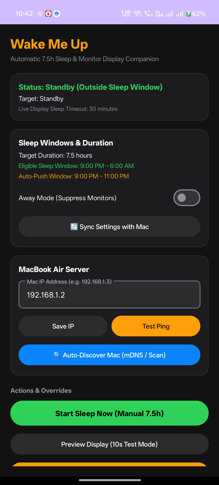 | 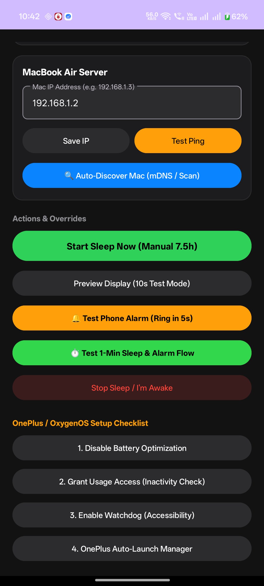 |  |

| 4. System Standby Status (Notification Shade) | 5. Active Sleep Notification (Real-time Target) | 6. Midnight Activity Prompt Notification |
| :---: | :---: | :---: |
| 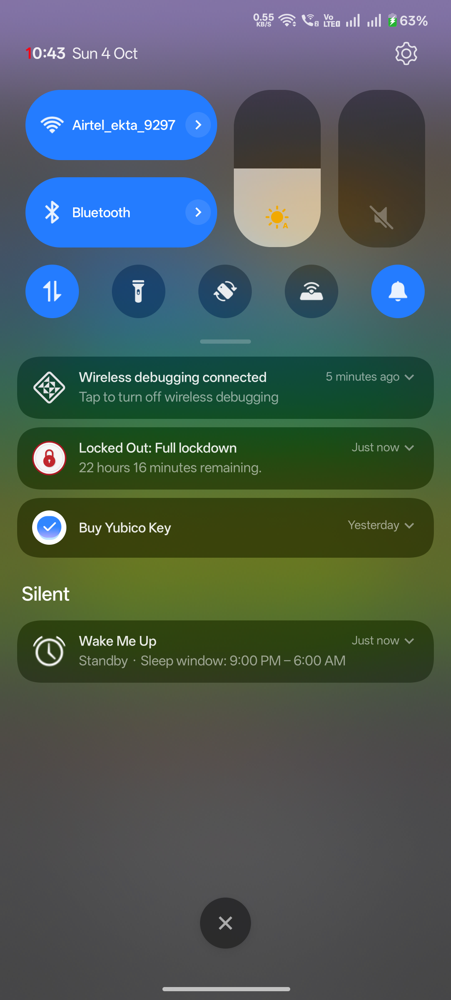 | 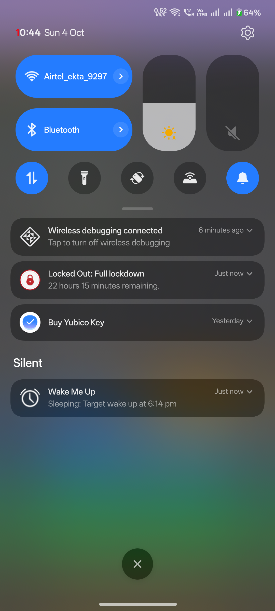 | 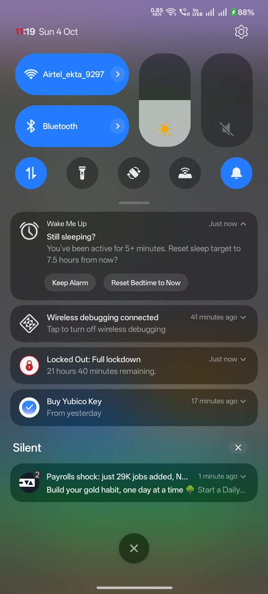 |

### 3.2 macOS Menu Bar App & Preferences Window (Fresh Live Captures)
Captured directly from macOS Sequoia on MacBook Air:

| Sleep Schedule Settings | Display Selection Manager | Ambient Colors & Test | Network & Pairing Status |
| :---: | :---: | :---: | :---: |
| 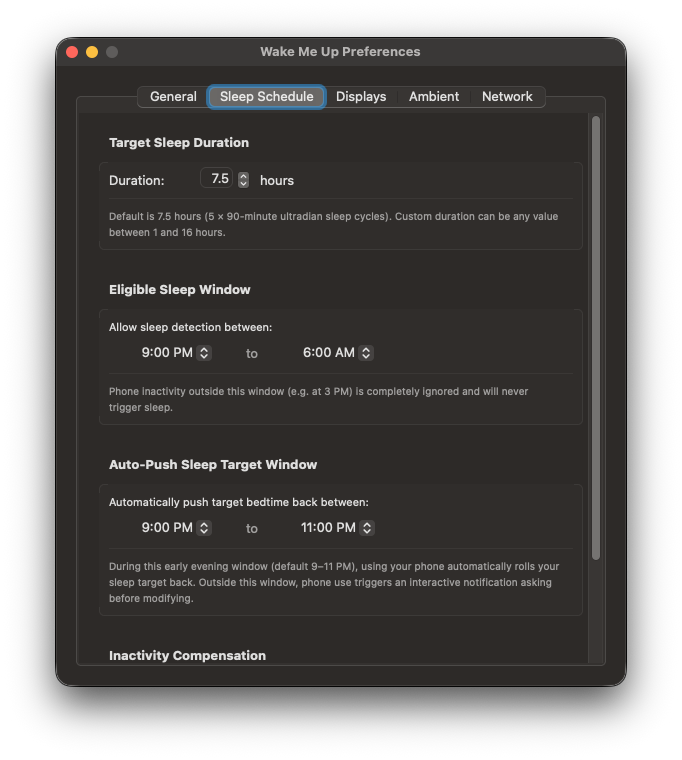 | 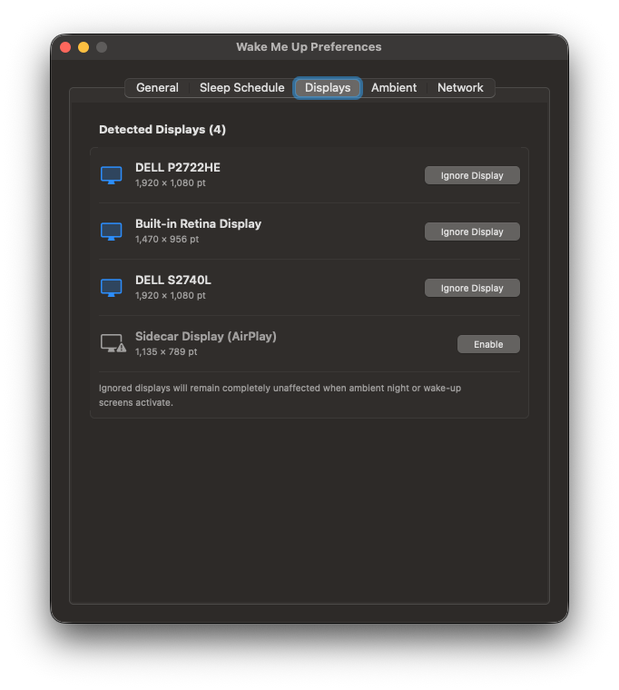 | 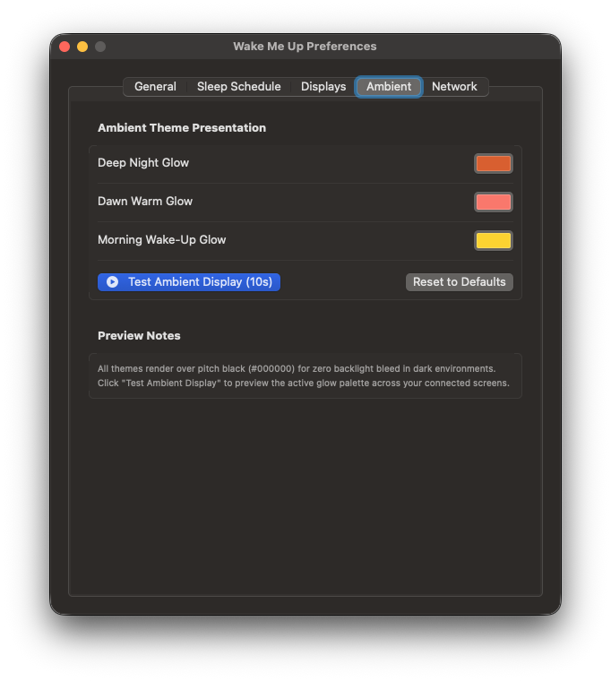 | 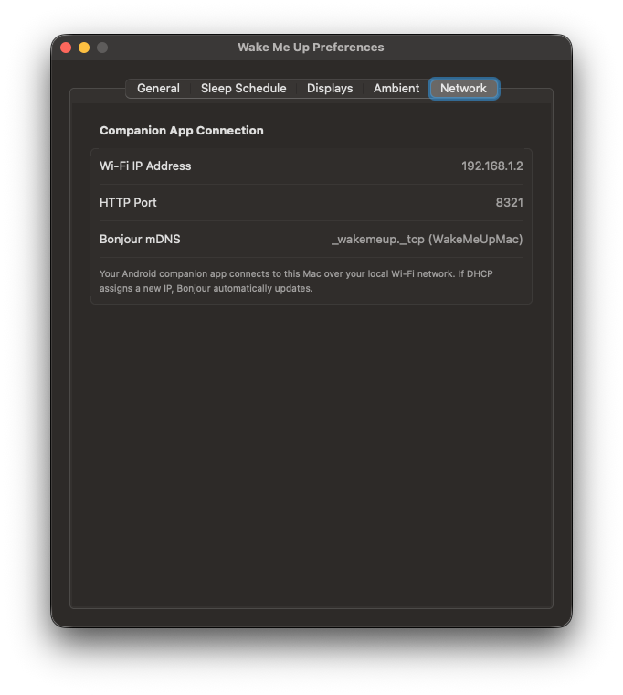 |

### 3.3 External Monitor Ambient Display Modes (Authentic 3-Stage Natural Sunrise)
Full-screen mirrored experience rendered on connected workstation displays:

| 1. Deep Night: Midnight Ember (#D95926) | 2. Dawn: Sunrise Coral (#FA7268) | 3. Wake-Up: Radiant Solar Gold (#FFD000) |
| :---: | :---: | :---: |
| 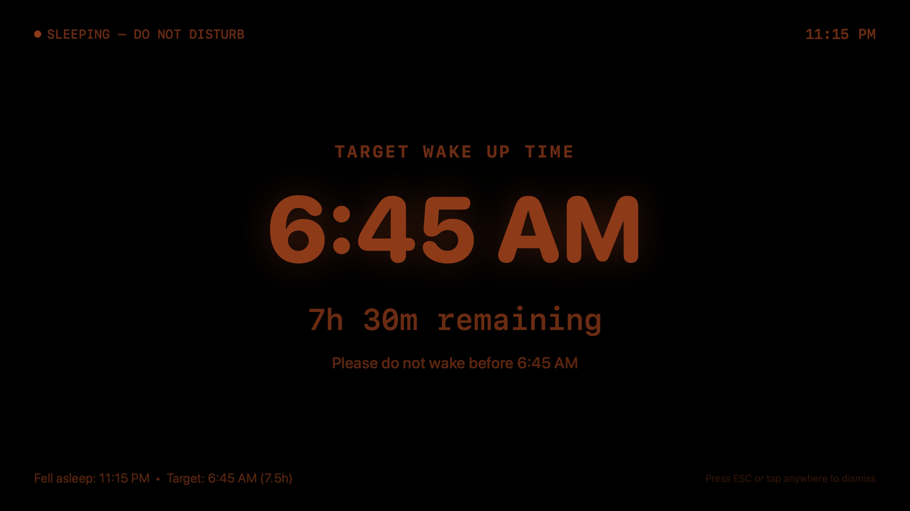 | 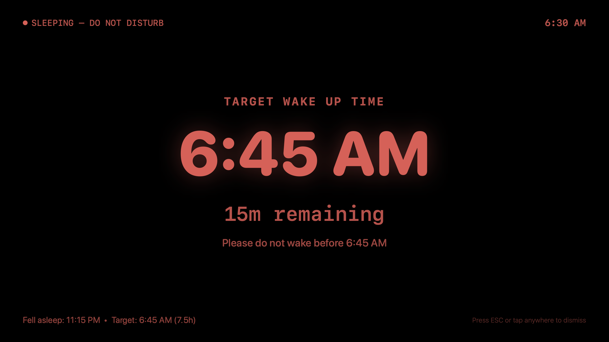 | 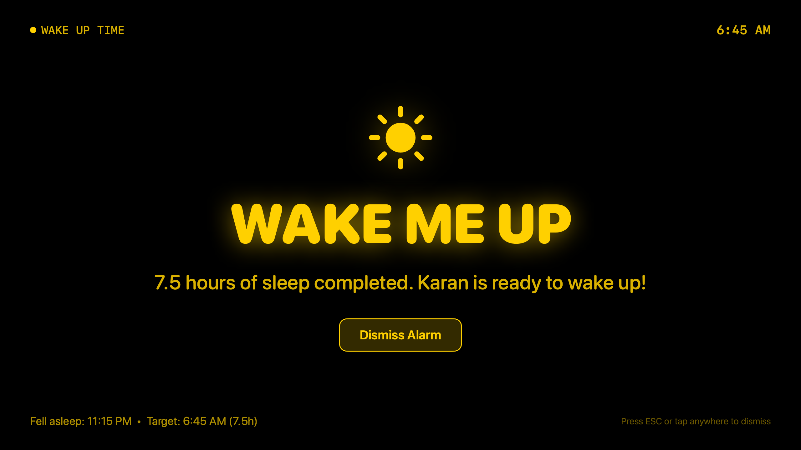 |

### 3.4 Remote Screen Message Billboard (Live Mobile & Monitor Pairing)
Custom manual messaging between phone and workstation displays:

| 1. Mobile Remote Controller (OnePlus 12) | 2. Mac Workstation Billboard Display (DELL Monitor) |
| :---: | :---: |
| 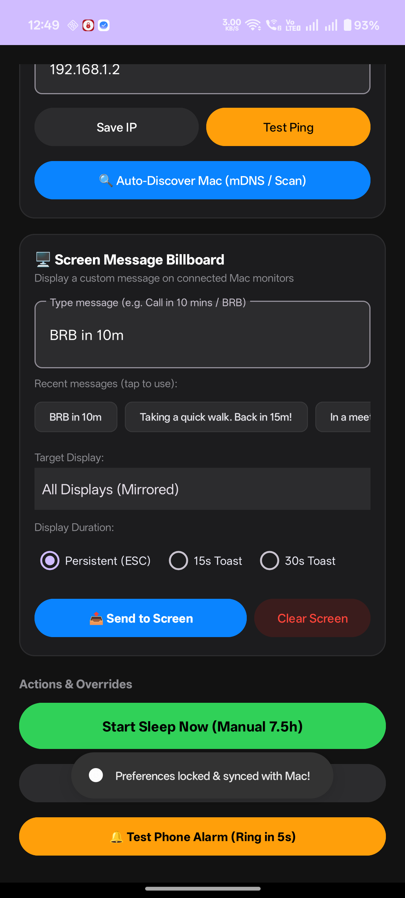 | 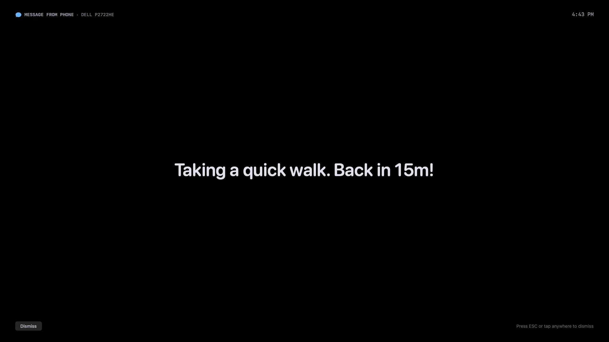 |

---

## 4. Technical Architecture & Communication Protocols

```mermaid
sequenceDiagram
    autonumber
    actor User as User (Bedroom)
    participant Phone as Android App (WakeMeUp)
    participant Mac as MacBook Air (HTTP Server :8321)
    participant Display as Workstation Monitors (Dell x2)

    User->>Phone: Locks Phone at 10:15 PM
    Phone->>Phone: InactivityCompensator analyzes UsageStats
    Phone->>Phone: Schedules Exact RTC Alarm for 5:45 AM
    Phone->>Mac: POST /api/sleep (bedtime, 450m duration)
    Mac->>Mac: PowerAssertionManager acquires display lock
    Mac->>Display: Shows Mirrored Ambient Countdown Overlay
    
    Note over Phone, Display: 10:15 PM - 5:15 AM (Restful Sleep - Screens Black with Dim Countdown)
    
    Note over Mac, Display: 5:15 AM (T - 30m): Transition to Dawn Amber Glow
    Mac->>Display: AmbientDisplayView fades into warm dawn
    
    Note over Phone, Display: 5:45 AM (Alarm Ringing)
    Phone->>Phone: AlarmTriggerService plays ringtone & vibration
    Phone->>User: Full-screen Alarm Activity ("Slide to Stop")
    Mac->>Display: Full Sunrise Glow ("Good Morning! Time to Wake Up")
    
    User->>Phone: Taps "Dismiss / I'm Awake"
    Phone->>Phone: Stops ringtone & cancels RTC alarm
    Phone->>Mac: POST /api/wake
    Mac->>Mac: Releases power assertions
    Mac->>Display: Hides ambient overlay; restores desktop
```

### 4.1 REST API Specification (`LocalHTTPServer.swift`)
The Mac exposes a lightweight, non-blocking HTTP server on port `8321`:

* **`GET /api/status`**
  - Returns current state (`idle`, `sleeping`, `wakeUpReady`), away mode, active monitors count, and power assertion status.
* **`POST /api/sleep`**
  - Body: `{"bedtime_epoch_ms": 1727980000000, "duration_minutes": 450.0, "reason": "auto_lock"}`
  - Activates sleep session, starts countdown tick, displays fullscreen ambient overlays.
* **`POST /api/wake`**
  - Body: `{}`
  - Dismisses ambient overlays, releases power assertions, returns app to idle.
* **`POST /api/test`**
  - Body: `{"duration_seconds": 10}`
  - Triggers 10-second preview of ambient display across all monitors.
* **`POST /api/away`**
  - Body: `{"is_away_mode": true}`
  - Toggles or sets Away Mode state.
* **`GET /api/config` & `POST /api/config`**
  - Two-way sync of sleep duration, window start/end hours, auto-push start/end hours, and inactivity offsets.
* **`GET /api/displays`**
  - Returns real-time metadata for all connected Mac displays: hardware display ID, localized name, dimensions (`width` x `height`), primary display flag (`is_main`), user preference (`is_ignored`), and active visual state (`active_mode`: `"idle"`, `"sleeping"`, `"message"`).
* **`POST /api/message`**
  - Body: `{"text": "Taking a quick walk. Back in 15m!", "target_display_id": "all", "duration_seconds": 15}`
  - Renders fullscreen high-contrast message billboard on targeted display(s) with power assertion lock and optional auto-dismiss timer.
* **`POST /api/message/dismiss`**
  - Body: `{"target_display_id": "all"}`
  - Dismisses active message overlay on targeted display(s) and seamlessly reverts each screen to either ongoing sleep countdown or idle desktop.
* **`GET /api/message/status`**
  - Returns all currently active message payloads, targeted displays, and remaining countdown seconds.

---

## 5. User Flows, States, & Critical Edge Cases

### State Transition Diagram
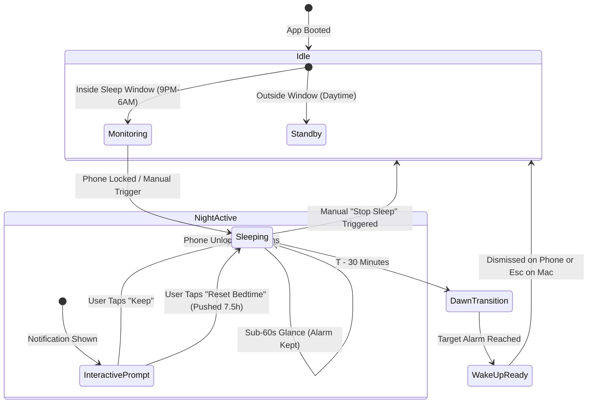

### 5.1 Comprehensive Edge Case Matrix

| Scenario | System Behavior | Rationale / Designer Considerations |
| :--- | :--- | :--- |
| **Phone reboot during sleep** | `BootCompletedReceiver` restores RTC alarm and restarts foreground service. | User never misses morning alarm due to OS updates or battery resets. |
| **Mac Wi-Fi IP changes (DHCP lease renewal)** | Dynamic mDNS discovery and subnet scan find new IP in < 200ms. | Zero manual reconfiguration required when router reconnects. |
| **MacBook lid closed in clamshell mode** | macOS handles external monitors via power assertions. | Monitors remain active if connected to power adapter. |
| **MacBook locked (`Cmd+Ctrl+Q`)** | macOS `loginwindow` blocks third-party overlays. | **Important Design Note**: The mobile UI must clearly guide users to leave their Mac unlocked before bed if they want the monitor ambient display. |
| **Phone disconnected from Wi-Fi** | Phone alarm still rings via local RTC hardware. | Fail-safe: Bedside alarm is 100% independent of network health. |
| **Brief bathroom wake (3:30 AM)** | Screen turns on < 60s -> Ignored as a glance. | Prevents annoying unnecessary alarm adjustments. |
| **Prolonged insomnia / movie viewing** | Screen stays on > 3 mins -> Prompt to push sleep. | Respects true sleep onset while offering choice. |
| **Daytime phone usage (3:00 PM)** | Inactivity ignored because time is outside 9PM–6AM window. | Doesn't trigger sleep when working or studying. |

---

## 6. Design System & UX Vision for the Mobile Redesign

### 6.1 The Designer's Challenge
The current mobile app works with 100% engineering precision, but the interface looks like a developer configuration panel (cards, debug buttons, raw text fields, IP inputs). 

**The goal is to transform this into an elegant, calm, high-end wellness app** (similar in feeling to *Oura, Apple Health, Rise Science, or Loftie*).

### 6.2 Key UX Pillars
1. **Calm Nocturnal Aesthetics**:
   - Deep OLED true blacks (`#000000`, `#0C0C0E`), subtle obsidian cards (`#161618`), and ambient accent glows (Ember `#D95926`, Sunrise Coral `#FA7268`, Solar Gold `#FFD000`).
   - Clean SF Pro / Inter typography with generous whitespace and breathable hierarchy.
2. **Hero Circadian Visualizer**:
   - An intuitive circular or arc-based sleep visualizer showing current bedtime, target wake-up time, and progress towards 7.5 hours.
   - Distinct color phases showing Sleep, Dawn (T-30m), and Wake.
3. **Effortless Hardware Sync Status**:
   - Instead of a clunky "MacBook Air Server IP: 192.168.1.2" card, display an elegant connection pill:  
     🟢 **Connected to MacBook Air** *(Tap to view network details or run a 10s preview)*.
4. **Intuitive Sleep Windows Selector**:
   - Replace numeric inputs with a clean visual 24-hour circular slider or timeline dial for:
     - **Eligible Sleep Window** (e.g. 9:00 PM – 6:00 AM)
     - **Auto-Push Window** (e.g. 9:00 PM – 11:00 PM)
5. **Calm Alarm Ringing Screen**:
   - A soothing full-screen sunrise gradient with smooth pulse animation, large readable time, and an affirmative **"Slide to Wake Up"** gesture (to prevent accidental taps while groggy).
6. **Separation of Setup vs. Daily Life**:
   - Move OnePlus background battery checklist, ADB debug tools, and raw IP settings into an easily accessible **"Settings & Device Health"** secondary sheet, keeping the home dashboard purely dedicated to rest and circadian status.
EOF
